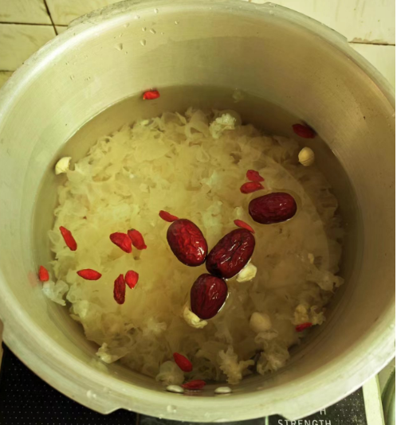
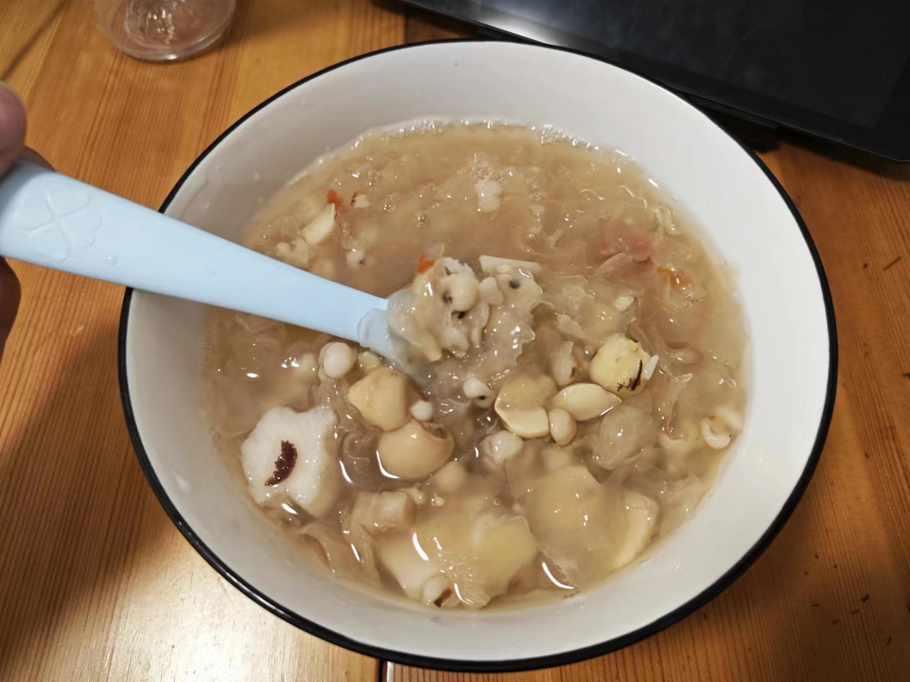

# 清补凉介绍

清补凉（xiéng bòu lēng） [6] ，在[海南话](https://baike.baidu.com/item/海南话/7506152?fromModule=lemma_inlink)中清补凉的“凉”字会读成阴上声，与用作[重量单位](https://baike.baidu.com/item/重量单位/4571790?fromModule=lemma_inlink)时的两字同音，是夏天清热祛湿的[老火汤](https://baike.baidu.com/item/老火汤/6894108?fromModule=lemma_inlink)。

清补凉的材料并不统一，有以健脾去湿为主，亦有以润肺为主。材料配方通常有以：[绿豆](https://baike.baidu.com/item/绿豆/19947280?fromModule=lemma_inlink)、红豆、[淮山](https://baike.baidu.com/item/淮山/2218956?fromModule=lemma_inlink)、[莲子](https://baike.baidu.com/item/莲子/398426?fromModule=lemma_inlink)、茨实、[薏米](https://baike.baidu.com/item/薏米/3116601?fromModule=lemma_inlink)、[西米](https://baike.baidu.com/item/西米/30566?fromModule=lemma_inlink)、[百合](https://baike.baidu.com/item/百合/7886?fromModule=lemma_inlink)、红[枣](https://baike.baidu.com/item/枣/2816923?fromModule=lemma_inlink)和[南北杏](https://baike.baidu.com/item/南北杏/1104622?fromModule=lemma_inlink)，并加入[西瓜](https://baike.baidu.com/item/西瓜/333718?fromModule=lemma_inlink)、[菠萝](https://baike.baidu.com/item/菠萝/220259?fromModule=lemma_inlink)、[龙眼](https://baike.baidu.com/item/龙眼/39025?fromModule=lemma_inlink)等水果多做成[糖水](https://baike.baidu.com/item/糖水/2495507?fromModule=lemma_inlink)，亦有以[黄芪](https://baike.baidu.com/item/黄芪/563358?fromModule=lemma_inlink)、[党参](https://baike.baidu.com/item/党参/13922054?fromModule=lemma_inlink)、淮山、莲子、[麦冬](https://baike.baidu.com/item/麦冬/396276?fromModule=lemma_inlink)、云苓、蓝枣、[无花果](https://baike.baidu.com/item/无花果/447?fromModule=lemma_inlink)、[猪腱](https://baike.baidu.com/item/猪腱/4660374?fromModule=lemma_inlink)肉的老火汤，但不同地区不同店家根据不同人群常又有其特色配料。

清补凉多以成糖水及老火汤的形式出现，不同地区有其独特的风味和食疗效果。经过改良，清补凉除了原先的糖水以外，还有[椰子水](https://baike.baidu.com/item/椰子水/22475266?fromModule=lemma_inlink)，[椰奶](https://baike.baidu.com/item/椰奶/7678171?fromModule=lemma_inlink)，[冰沙](https://baike.baidu.com/item/冰沙/10959443?fromModule=lemma_inlink)和[冰激凌](https://baike.baidu.com/item/冰激凌/6206315?fromModule=lemma_inlink)等不同吃法。流行于中国[海南](https://baike.baidu.com/item/海南/13346?fromModule=lemma_inlink)、广东、香港和[澳门](https://baike.baidu.com/item/澳门/24335?fromModule=lemma_inlink)、广西等地区。

清补凉被誉为“舌尖上的清凉”。曾被[苏轼](https://baike.baidu.com/item/苏轼/53906?fromModule=lemma_inlink)誉为“[椰树](https://baike.baidu.com/item/椰树/2805578?fromModule=lemma_inlink)之上采[琼浆](https://baike.baidu.com/item/琼浆/10015699?fromModule=lemma_inlink)，捧来一碗白玉香”。 [1]

--- copy form 百度百科 [清补凉_百度百科 (baidu.com)](https://baike.baidu.com/item/清补凉/1191233)

# 必备工具和原材料

电磁炉（可替代为煤气炉）

高压锅

食用水

白糖

清补凉（银耳、土茯苓、淮山干、薏米、莲子、红枣、枸杞）---补充：还可以放一些玉竹、龙眼干

# 操作

- 备料阶段

银耳**提前半小时**泡发

淮山干、土茯苓、薏米提**前泡发几个小时**。Tips：做法上没有说这些需要提前泡发，但实际尝试过程中发现煮好后这些太硬了

- 烹饪阶段

都放进高压锅里，加水，水需要高于食材较多，因为银耳会吸水，不然水分会煮干。

时间：高压锅上气之后煮13分钟，电磁炉火力在中档上。

- 调味阶段

加白糖，需要调成偏甜口

待放凉后放进冰箱冷藏，需要吃的时候再提前放进冷冻1小时（这样才够冰）

# 结果

# 备注

此配比为梅州版本，淘宝买清补凉料包搭配的，对于喜欢吃的原料可以酌情增加配比